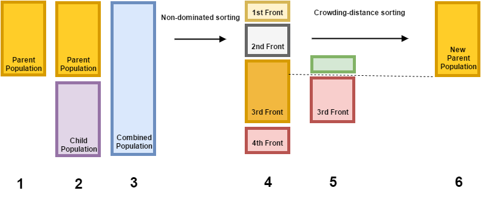

# NSGA-2-in-Julia




### This is still a work in progress. 

Repository for implementation of multi-objective optimization algorithm NSGA-II in Julia.

Repositório para implementação do algoritmo de otimização multiobjetivo NSGA-II na linguagem Julia.

### How do I run this?

* Firstly, get [Julia-0.4.1](http://julialang.org/downloads/)
* Then:
```sh
$ git clone https://github.com/gsutavo/NSGA-2-in-Julia
$ cd NSGA-2-in-Julia/src
$ julia
$ include("nsga2.jl")
$ nsga2()
```

You need the package [Gadfly](http://dcjones.github.io/Gadfly.jl/). If you don't have it installed, you ought to instal by doing:
```sh
$ julia
$ Pkg.add("Gadfly")
```

## More information:
- Julia: http://julialang.org/
- NSGA-2: Deb, Kalyanmoy, et al. "[A fast and elitist multiobjective genetic algorithm: NSGA-II](http://ieeexplore.ieee.org/xpl/login.jsp?tp=&arnumber=996017&url=http%3A%2F%2Fieeexplore.ieee.org%2Fxpls%2Fabs_all.jsp%3Farnumber%3D996017)" Evolutionary Computation, IEEE Transactions on 6.2 (2002): 182-197.
